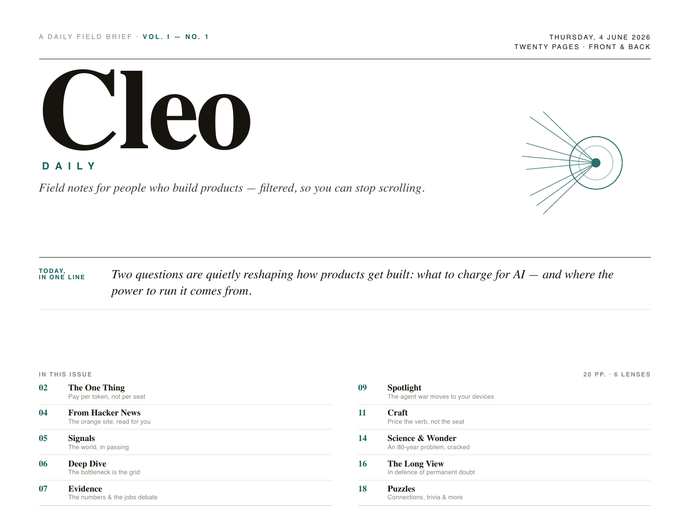
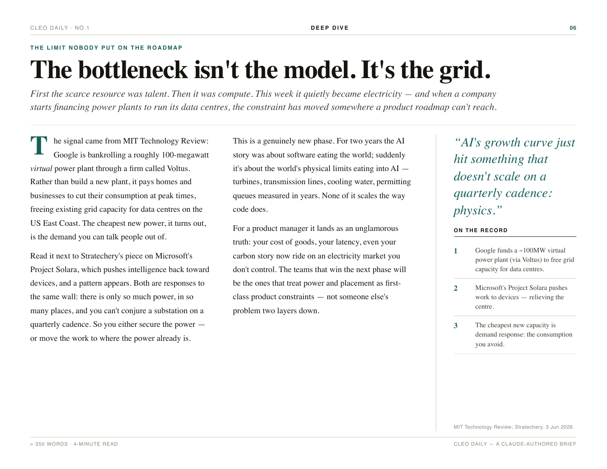

<div align="center">

# Cleo Daily

### The future is hyper-personal — and *taste*, not volume, is the scarce thing.

**An open-source engine that reads hundreds of sources a day, filters out ~99% of the noise,
and prints a hyper-personal magazine you can hold.**

`Anthropic routines` · `MCP` · `headless Chrome` · `Python` · `Tailscale`

<!-- ───────────────────────────────────────────────────────────────────────
  INLINE VIDEO — one manual step to get the native player (your pick).
  1. open any issue/PR on GitHub, drag `assets/cleo-daily-web.mp4` (2.1 MB)
     into the comment box; GitHub uploads it and gives you a URL like
     https://github.com/user-attachments/assets/XXXXXXXX
  2. paste that URL on its own line right below this comment
  3. delete the clickable-thumbnail block beneath it
  Until then, the thumbnail below works and links to the walkthrough.
──────────────────────────────────────────────────────────────────────── -->

[](https://github.com/ankitaggarwal/cleo-daily/raw/main/assets/cleo-daily-web.mp4)

**▶ [Watch the 77-second walkthrough](https://github.com/ankitaggarwal/cleo-daily/raw/main/assets/cleo-daily-web.mp4)** — from raw feeds to a printed brief.

*The cure for the feed is a thing that can't scroll back.*

</div>

---

## What it is

Cleo Daily turns a wide, curated set of blogs, newsletters and feeds into a calm, dense,
**landscape print brief** — once a day, automatically, white-on-white for an ink-tank printer
so you can read on paper and stop scrolling. It was built for one reader (a product manager
drowning in tabs), but the engine is general: **change one config file and it's a different
publication.**

The whole design is one split:

> ### Boring, reliable work is code. Work that needs taste is the model.

- Connecting to sources, normalising items, rendering HTML→PDF, publishing — **deterministic code** (`cleo`).
- Deciding what to keep, what to cut, what matters, how to say it — **the model** (the *Editor*, a scheduled Claude routine).

There is no separate orchestrator. **The scheduled Claude routine *is* the engine.**

> **What it taught me:** the hard part wasn't the tech, it was *subtraction* — a thin day has to
> get a thin issue, or the whole thing stops being trusted.

## How it works

```
cleo.toml ─▶  THE ROUTINE  (Claude, scheduled daily)               who does it
  persona       1 INGEST    pull every source over MCP, normalize    cleo  (code)
  features      2 EDIT      read 200–400 · keep ≤1-in-10 · cluster ·  ROUTINE ◀ the heart
  sources                   rank · write in voice · commission art    (the model / taste)
  theme         3 RENDER    issue.json + theme → Chrome → print PDF   cleo  (code)
  publish       4 PUBLISH   file · git · email · web                  cleo  (code)
```

Run it by hand to see the whole loop:

```bash
uv venv && uv pip install -e '.[dev]'   # Python 3.10+, Chrome on PATH
cleo doctor                              # what's configured, live, and missing
cleo run --date today                    # ingest → edit → render → publish → PDF
```

`cleo run` produces a real, print-ready PDF. In production a Claude routine runs the same loop
on a schedule, and *it* is the Editor — so the taste step needs no API key of its own.

## The Editor's doctrine

The magic isn't aggregation — it's **subtraction**. The Editor prompt
([`cleo/skill/cleo-editor.md`](cleo/skill/cleo-editor.md)) is non-negotiable:

- **1-in-10, or stricter.** Read 200–400 items a day; keep ≤10% as candidates; feature only the strongest ~14.
- **Density, not volume.** Every inch carries an idea, a consequence, or a delight — never "this happened."
- **Wide angle, always.** Each issue spans ≥4 lenses and features ≥1 piece from outside tech.
- **Honesty over filling.** A thin day gets a thin issue. Never pad.
- **Originality, not reproduction.** Quote sparingly, attribute always, link to the source — never replace it.

## Personalize it — features & keys

Two files. **`cleo.toml` is the switchboard; `.env` holds the secrets.** A capability runs only
if its flag is **on** *and* its key is **present** — so a half-configured feature degrades to off
instead of crashing or printing a placeholder.

```toml
# cleo.toml — flip what you want on
[features]
dedupe   = true     # dedupe against recent issues (no key)
weather  = false    # local weather line            (no key)
images   = false    # line-art illustrations         (GEMINI_API_KEY)
inbox    = false    # Gmail newsletters              (GMAIL_OAUTH_TOKEN)
signals  = false    # an X / Twitter list            (X_BEARER_TOKEN)
email    = false    # email the finished PDF         (RESEND_API_KEY + CLEO_SUBSCRIBERS)
```

```bash
cp .env.example .env     # paste keys for only the features you enabled
cleo doctor              # ● live / ○ on, missing key / ○ off — at a glance
```

Full walkthrough in **[CONFIG.md](CONFIG.md)**.

## Sources are MCP servers

Every source is an MCP server — RSS, Gmail, X, your calendar, the weather, or one you write.
This repo **ships the supporting servers** a routine needs (under [`servers/`](servers/)):

| Server | Key? | What it feeds |
|---|---|---|
| **`rss`** | none | the whole default roster — the keystone |
| **`weather`** | none | a one-line local forecast (Open-Meteo) |
| `gmail` · `x` · `calendar` | yes | the reader's own lenses *(scaffolds)* |

The default roster (in [`cleo.toml`](cleo.toml)) is a deliberately wide net across six lenses:

> **Strategy** Stratechery · Platformer · Ben Evans · Not Boring · Exponential View · a16z
> **Product** Lenny's · SVPG · Mind the Product · **AI/eng** Import AI · One Useful Thing · Simon Willison · Pragmatic Engineer · MIT Tech Review
> **Wide-angle** Marginal Revolution · Noahpinion · Slow Boring · Astral Codex Ten · Works in Progress · Construction Physics
> **Wire & curiosity** Hacker News · The Verge · Ars Technica · Quanta · Smithsonian · Aeon
> **Yours** Gmail newsletters · an X list · your calendar · weather

## Run it as a Claude routine

The engine is built to run unattended. Point a scheduled Claude routine at the Editor skill;
it calls `cleo ingest`, writes `issue.json` by following the doctrine, then `cleo render` and
`cleo publish`. See **[routine/README.md](routine/README.md)** for the schedule + the prompt.

## What an edition looks like

Each run writes a print-ready PDF to a local `editions/` folder. Below is an interior page from
Vol. I, No. 1. The issue is *consumption-ready*: a widget appears **only** if there's real data
behind it — with no live weather feed that morning, the Desk leaves its space empty and says so,
rather than printing a placeholder.

<div align="center"></div>

## Design constraints (why it looks like this)

- **Pure white background**, one restrained accent ink — built for ink-tank printers; no wasted toner.
- **No photographs.** Charts, diagrams and marks are inline SVG line-art.
- **Landscape, print-first.** A4/Letter landscape, real margins, page-break rules — made to be printed, folded, and read away from a screen.
- Typeset in Fraunces (display), Source Serif 4 (body), Inter (labels). The theme lives in [`themes/broadsheet-mono/`](themes/broadsheet-mono/).

## Architecture

```
cleo/            the engine (deterministic plumbing)
  config.py        cleo.toml + .env + [features] → resolved Config
  schema.py        the Item and Issue contracts (pydantic)
  sources/rss.py   the built-in RSS adapter (shared with the MCP server)
  ingest.py        pull every source · normalize · dedupe → items.jsonl
  edit.py          optional local Editor (Anthropic API) — the routine does this in prod
  render.py        issue.json + theme → HTML → headless Chrome → PDF
  publish/         file · git · email · web (one function each)
  cli.py           cleo doctor | init | ingest | edit | render | publish | run
  skill/           the Editor prompt — the routine's program
servers/         the supporting MCP servers (rss, weather, …)
themes/          broadsheet-mono — the first installable theme
tests/           the stress suite (config, schema, rss, ingest, render edges)
```

Full design in **[ARCHITECTURE.md](ARCHITECTURE.md)**.

## Contributing

Five extension points, each a small, well-defined contract: an **MCP source** (a server in
`servers/`), a **theme** (a folder in `themes/`), a **section type** (schema + a template), or a
**publisher** (a function in `cleo/publish/`). Issues and PRs welcome.

## License

[MIT](LICENSE). The engine is yours; the sources are theirs (Cleo links and attributes, it
doesn't republish); the printer is yours.

---

<div align="center"><sub>Read hundreds. Keep a tenth. Print on paper. Make them wide.</sub></div>
